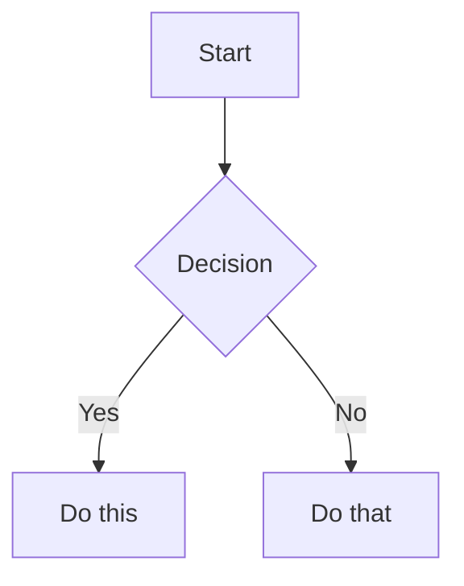

## When
You need to write or edit Markdown files in an Obsidian vault and want to use Obsidian-specific syntax correctly. Use when creating KB articles, issue notes, drafts, or any vault content.

## Inputs
- A syntax question or a file that needs Obsidian-specific formatting
- Optional: the specific feature (wikilinks, embeds, callouts, properties, tags)

## Procedure

1. Identify the Obsidian feature needed. Match the request to one of the sections below.
2. Return the relevant syntax with a minimal example.
3. If the request involves multiple features, cover each in order.

### Wikilinks (Internal Links)

```markdown
[[Note Name]]                          Link to note
[[Note Name|Display Text]]             Custom display text
[[Note Name#Heading]]                  Link to heading
[[Note Name#^block-id]]                Link to block
[[#Heading in same note]]              Same-note heading link
```

Define a block ID by appending `^block-id` to any paragraph:

```markdown
This paragraph can be linked to. ^my-block-id
```

For lists and quotes, place the block ID on a separate line after the block.

### Embeds

Prefix any wikilink with `!` to embed its content inline:

```markdown
![[Note Name]]                         Embed full note
![[Note Name#Heading]]                 Embed section
![[image.png]]                         Embed image
![[image.png|300]]                     Embed image with width
```

### Callouts

```markdown
> [!note]
> Basic callout.

> [!warning] Custom Title
> Callout with a custom title.

> [!faq]- Collapsed by default
> Foldable callout (- collapsed, + expanded).
```

Common types: `note`, `tip`, `warning`, `info`, `example`, `quote`, `bug`, `danger`, `success`, `failure`, `question`, `abstract`, `todo`.

### Properties (Frontmatter)

```yaml
---
title: My Note
date: 2024-01-15
tags:
  - project
  - active
aliases:
  - Alternative Name
---
```

Default properties: `tags` (searchable labels), `aliases` (alternative note names), `cssclasses` (CSS classes for styling).

### Tags

```markdown
#tag                    Inline tag
#nested/tag             Nested tag with hierarchy
```

Tags can contain letters, numbers (not first character), underscores, hyphens, and forward slashes. Tags can also be defined in frontmatter under the `tags` property.

### Comments

```markdown
This is visible %%but this is hidden%% text.

%%
This entire block is hidden in reading view.
%%
```

### Highlights

```markdown
==Highlighted text==
```

### Math (LaTeX)

```markdown
Inline: $e^{i\pi} + 1 = 0$

Block:
$$
\frac{a}{b} = c
$$
```

### Diagrams (Mermaid)

````markdown

````

### Footnotes

```markdown
Text with a footnote[^1].

[^1]: Footnote content.

Inline footnote.^[This is inline.]
```

## Output
Inline syntax reference with examples. No file written.

## Hand-off
None — terminal skill. The caller uses the syntax reference to format their content.

## Rating
| ✅ success | ⚠️ partial | ❌ failed |
- ✅ success — correct syntax provided for the requested feature
- ⚠️ partial — syntax provided but edge case not covered
- ❌ failed — requested feature not documented in this skill
